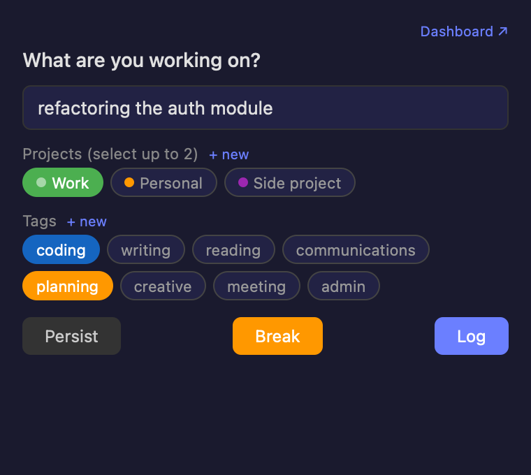
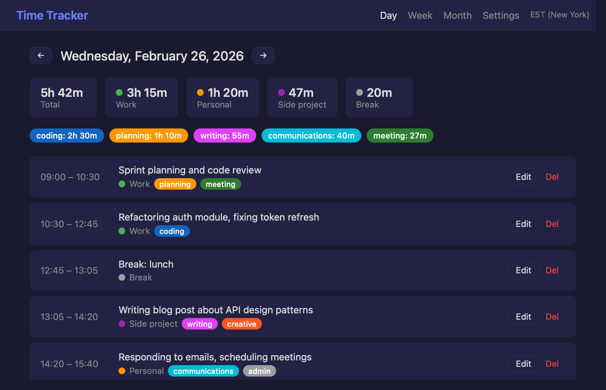
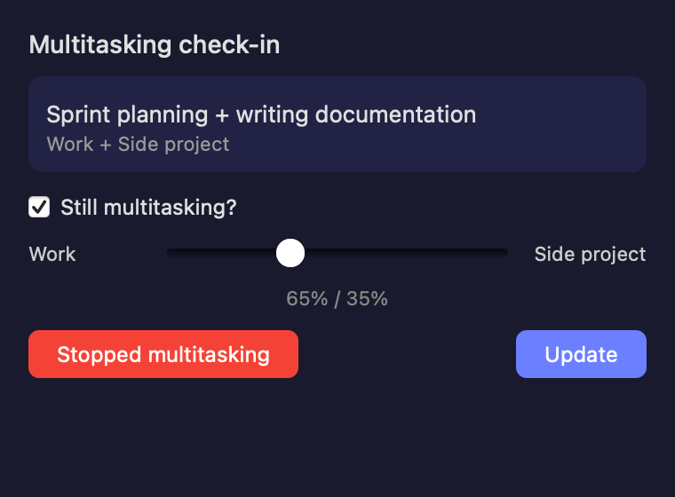
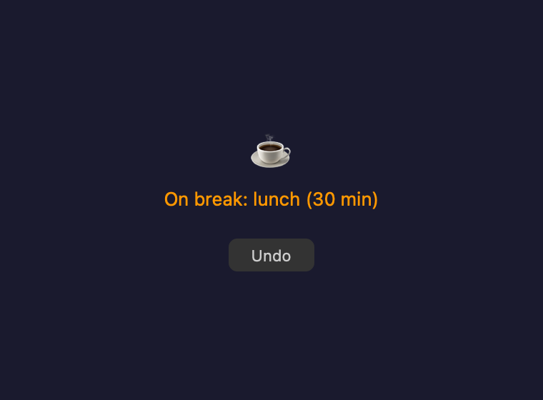
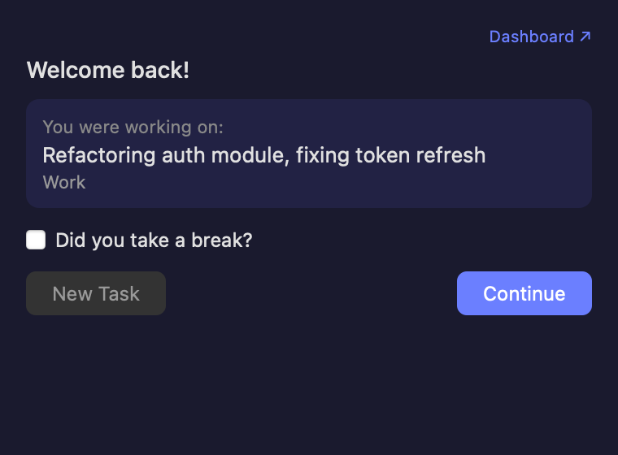

# local-time-tracker

Local macOS time tracker that prompts you every 30 minutes to log what you're working on. Uses GPT to auto-categorize entries into projects and tags from natural language input. Inspired by [Daily Time Tracking](https://dailytimetracking.com).

## What it looks like

**Prompt panel** -- appears every 30 minutes at the top-right of your screen:



**Dashboard** -- browse entries by day, week, or month with project/tag breakdowns:



**Multitask check-in** -- when working on 2 projects, a slider lets you split time:



**Break status** -- confirms your break with an undo option:



**Resume after idle** -- asks if you took a break and whether to continue or switch:



## Features

- Native macOS floating panel prompts every 30 minutes (or 15 minutes when multitasking)
- Natural language input auto-categorized by GPT into projects and tags
- Idle detection: auto-pauses after 5 minutes of inactivity, prompts on resume
- Multitasking support: select 2 projects, slider to split time allocation
- Break tracking with natural language duration ("lunch", "30 mins", "quick coffee")
- Web dashboard at localhost:5123 with day/week/month views
- Bulk edit entries, manage projects/tags with descriptions for better AI accuracy
- Timezone-aware display with selectable timezone
- iCloud sync for cross-device backup
- Optional Vercel + Turso deployment for cloud-accessible dashboard
- Optional n8n integration for weekly email summaries
- API cost tracking with alerts
- CSV export of all data

## Requirements

- macOS (uses native AppKit/WebKit for the prompt panel)
- Python 3.9+
- OpenAI API key (uses gpt-5-nano, costs roughly $0.01--0.05/month)

## Quick start

```bash
git clone https://github.com/anushreechaudhuri/local-time-tracker.git
cd local-time-tracker
./setup.sh
```

The setup script will:
1. Create a Python virtual environment and install dependencies
2. Prompt for your OpenAI API key (and optionally Turso/email credentials)
3. Install a LaunchAgent so the tracker starts automatically on login
4. Start the tracker immediately

The dashboard is at http://127.0.0.1:5123. Prompts appear as a small floating panel at the top-right of your screen.

## How it works

Every 30 minutes, a native panel appears asking what you're working on. Type a natural language description and the AI categorizes it into your projects and tags. You can also manually select projects/tags, or let the AI handle it entirely.

**Buttons:**
- **Persist** -- continue the same task as before
- **Break** -- pause tracking (type a duration like "30 mins" or "lunch")
- **Log** -- log a new entry

If you close the panel without responding, the app assumes you're continuing your previous task. If you're idle for 5+ minutes, it auto-pauses and asks what happened when you return.

### A note on multitasking

This tracker lets you select up to 2 projects at once. Multitasking isn't necessarily encouraged, but it recognizes the reality that most people are juggling multiple things at a time, especially in a world where you're delegating work to agents while doing something else. Rather than pretending you're only ever doing one thing, the tracker makes you mindful about how you're splitting your capacity and keeps you focused on two things at most. More context switching than that is difficult and unproductive, and the app will nudge you if it detects you're spreading across 3+ projects.

## Cloud dashboard (optional)

To access the dashboard from any device:

1. Install [Turso](https://docs.turso.tech/cli/installation) (free SQLite-in-the-cloud):
   ```bash
   brew install tursodatabase/tap/turso
   turso auth signup
   turso db create timetracker
   turso db show timetracker  # copy the URL
   turso db tokens create timetracker  # copy the token
   ```

2. Add to `.env`:
   ```
   TURSO_DB_URL=libsql://your-db-url.turso.io
   TURSO_DB_TOKEN=your-token
   ```

3. Deploy to [Vercel](https://vercel.com):
   ```bash
   vercel --prod
   ```
   Set `TURSO_DB_URL` and `TURSO_DB_TOKEN` as environment variables in the Vercel dashboard.

The local app syncs to Turso every 5 minutes. The Vercel dashboard reads from Turso.

## Weekly email summary (optional)

Uses [n8n](https://n8n.io) (self-hosted, free):

1. Run n8n: `npx n8n`
2. Import `n8n/weekly-summary-workflow.json`
3. Configure SMTP credentials for your email
4. Update the HTTP request URL to your Vercel dashboard URL

## Customization

Edit `config.py` to change:
- Prompt intervals (default: 30 min normal, 15 min multitasking)
- Idle threshold (default: 5 min)
- Default projects and tags
- API cost alert threshold (default: $1/month)

Add project/tag descriptions in the dashboard Settings page to improve AI categorization accuracy.

## Uninstall

```bash
./setup.sh uninstall
```
